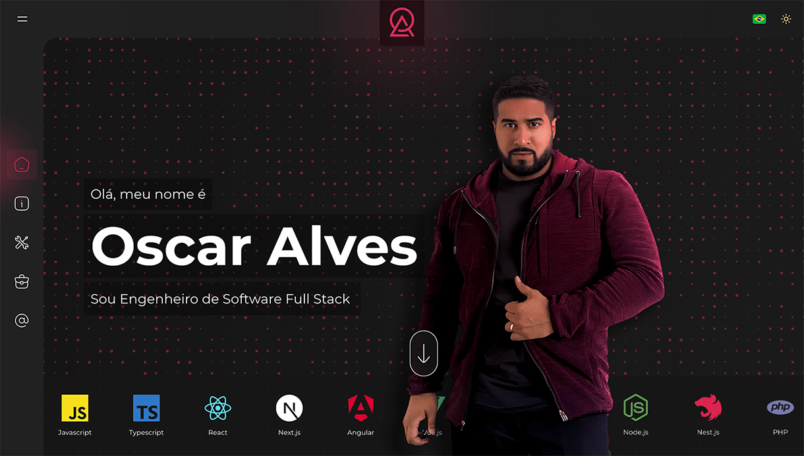

# 🖥️ oscaralves-dev



This is the source code for my personal website, a project developed with [Next.js](https://nextjs.org) and various modern front-end technologies.

## 🚀 Technologies Used

- **Framework**: [Next.js 15](https://nextjs.org) + [React 19](https://react.dev/)
- **Languages**: [TypeScript](https://www.typescriptlang.org/) + [JavaScript](https://developer.mozilla.org/en-US/docs/Web/JavaScript)
- **UI & Styling**: [Tailwind CSS](https://tailwindcss.com/) + [ShadCN UI](https://ui.shadcn.com/)
- **Animations**: [Framer Motion](https://www.framer.com/motion/) & [React Type Animation](https://www.npmjs.com/package/react-type-animation)
- **Form Validation**: [React Hook Form](https://www.react-hook-form.com/get-started/) + [Zod](https://zod.dev/)

## 🎯 Features

- 🎨 **Modern UI** with **Dark Mode** and **Light Mode**, supported by `next-themes`
- ⚡ **Optimized performance** using **Turbopack** and pre-rendering strategies
- 📈 **Enhanced SEO** with **OpenGraph, Twitter Cards, and automatic Sitemap**
- 📩 **Contact Form** with validation via `React Hook Form` and `Zod`, and email sending via `Mailgun.js`

## 🛠️ Installation and Setup

Clone the repository:

```bash
git clone https://github.com/oskaralves/oscaralves-dev.git
cd oscaralves-dev
```

Install dependencies:

```bash
npm install
# or
yarn install
# or
pnpm install
```

## 🚀 Getting Started

Run the development server:

```bash
npm run dev
# or
yarn dev
# or
pnpm dev

```

Open [http://localhost:3000](http://localhost:3000) in your browser to see the result.

You can start editing the page by modifying app/page.tsx. The page auto-updates as you edit the file.

## 📦 Build

To build the project for production:

```bash
npm run build
# or
yarn build
# or
pnpm build
```

To start the production server:

```bash
npm run start
# or
yarn start
# or
pnpm start
```
